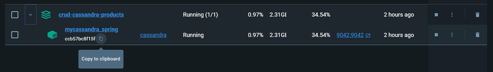
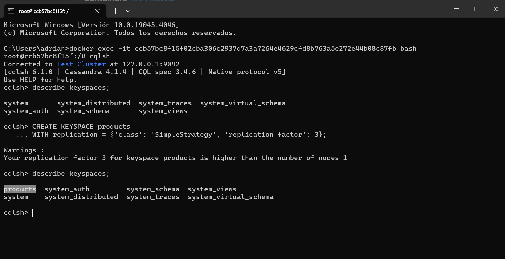
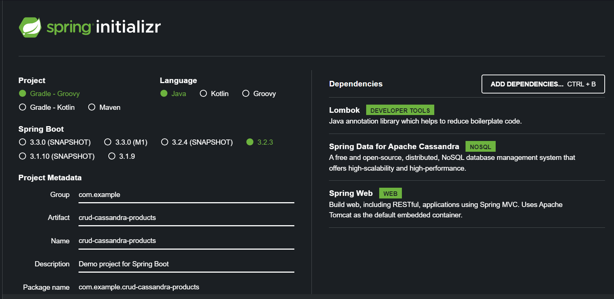
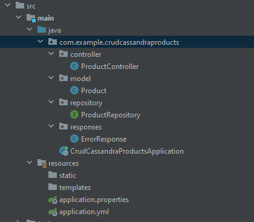

# Guía de Instalación y Uso: Cassandra, Docker y Spring

Esta guía proporciona instrucciones paso a paso para instalar y configurar un entorno de desarrollo utilizando Cassandra como base de datos desde Docker y Spring Framework para desarrollar una API CRUD (Create, Read, Update, Delete) sencillo.


## Contenido

1. [Introducción](#introducción)
2. [Requisitos Previos](#requisitos-previos)
3. [Instalación de Cassandra con Docker](#instalación-de-cassandra-con-docker)
4. [Configuración de Spring Boot](#configuración-de-spring-boot)
5. [Desarrollo de la Aplicación](#desarrollo-de-la-aplicación)
6. [Ejecución de la Aplicación](#ejecución-de-la-aplicación)
7. [Recursos Adicionales](#recursos-adicionales)

## 1. Introducción

Esta guía tiene como objetivo proporcionar una configuración básica para desarrollar una API CRUD utilizando Cassandra como base de datos con Docker y Spring Framework para la lógica de negocio y la exposición de servicios RESTful.


## 2. Requisitos Previos

Antes de comenzar, asegúrate de tener instalados los siguientes componentes en tu sistema:

- Docker o Docker Desktop. [Enlace](https://www.docker.com/products/docker-desktop/)

- Entorno de desarrollo preferido, en mi caso IntelliJ.  [Enlace](https://www.jetbrains.com/es-es/idea/)


## 3. Instalación de Cassandra con Docker

Cassandra es una base de datos NoSQL altamente escalable y de alto rendimiento. Para instalar y ejecutar Cassandra utilizando Docker, sigue estos pasos:

1. Creamos un ``docker-compose.yml``

2. En el archivo insertamos lo siguiente: 
```
version: '3.1'
services:
  mycassandra:
    image: cassandra
    container_name: mycassandra_spring
    ports:
      - "9042:9042"
```

3. Guardamos los cambios y buscamos en el contenedor el nombre para atacar a ese contenedor.


4. Una vez copiado el nombre del contenedor vamos al directorio del archivo y lanzamos la terminal ejecutando lo siguiente:

````
docker exec -it 'nombre_contenedor' bash
````
En mi caso seria ``docker exec -it ccb57bc8f15f02cba306c2937d7a3a7264e4629cfd8b763a5e272e44b08c87fb bash``
o ``docker exec -it mycassandra_spring bash``


6. Una vez hecho esto accedemos a cassandra, escribiendo ``cqlsh``.

7. Creamos un keyspace, en mi caso productos
```
CREATE KEYSPACE products
WITH replication = {'class': 'SimpleStrategy', 'replication_factor': 3};
```


8. Insertamos ``use products`` para trabajar en la keyspace

9. Creamos la tabla
```
CREATE TABLE Product (
    id TEXT PRIMARY KEY,
    name TEXT,
    description TEXT,
    price DOUBLE,
    image TEXT,
    category TEXT
);
```


## 4. Configuración de Spring Boot

1. Accedemos a la página [Spring initiazr](https://start.spring.io).

2. Configuramos de la siguiente manera:



3. Obtenemos el codigo y trabajamos con el repositorio proporcionado, teniendo la siguiente estructura de archivos:



4. Conectamos con cassandra, para ello creamos el archivo ``application.yml`` dentro de la carpeta ``resources``
 cuyo contenido es el siguiente: 

```
spring:
  data:
    cassandra:
      entity-base-package: cassandra
  cassandra:
    contact-points: mycassandra
    keyspace-name: products
    port: 9042
```

Teniendo en cuenta seleccionar el keyspace con el que estamos trabajando creado en cassandra.

## 5. Desarrollo de la Aplicación
1. Creamos nuestro modelo, en este caso, Product:
```
@Table
@Data
@NoArgsConstructor
@AllArgsConstructor
public class Product {

    @PrimaryKey
    private String id;


    private String name;


    private String description;


    private Double  price;


    private String image;


    private String category;
}
```

2. Creamos el ProductRepository que extiende de CassandraRepository para conectar con la base de datos:
```
public interface ProductRepository extends CassandraRepository<Product, String> {
}
```

3. Creamos una clase ErrorResponse para gestionar los errores:

```
public class ErrorResponse {


    private int status;
    private String error;


    public ErrorResponse(int status, String message) {
        this.status = status;
        this.error = message;

    }


}
```

4. En el controlador gestionamos el CRUD. Por ejemplo, para el método POST:

```
  @PostMapping("/products")
    public ResponseEntity<?> addProduct(@RequestBody Product product) {
        if (product.getId() == null || product.getName() == null || product.getDescription() == null ||
                product.getPrice() <= 0 || product.getImage() == null || product.getCategory() == null) {
            ErrorResponse errorResponse = new ErrorResponse(HttpStatus.BAD_REQUEST.value(), "All fields are required. Please provide values for id, name, description, price, image, and category.");
            return new ResponseEntity<>(errorResponse, HttpStatus.BAD_REQUEST);
                }
        //Verificar si la ID del producto ya existe en la base de datos
        if (productRepository.existsById(product.getId())) {
            ErrorResponse errorResponse = new ErrorResponse(HttpStatus.BAD_REQUEST.value(), "Product with ID " + product.getId() + " already exists");
            return new ResponseEntity<>(errorResponse, HttpStatus.BAD_REQUEST);}

        //verficar que el precio sea mayor que 0
        if (product.getPrice() <= 0) {
            ErrorResponse errorResponse = new ErrorResponse(HttpStatus.BAD_REQUEST.value(), "Price must be greater than 0");
            return new ResponseEntity<>(errorResponse, HttpStatus.BAD_REQUEST);
        }

        // Guardar el nuevo producto en la base de datos
        Product savedProduct = productRepository.save(product);

        // Retornar el producto guardado junto con el código de estado HTTP 201 (Created)
        return ResponseEntity.status(HttpStatus.CREATED).body(savedProduct);
    }
```

5. Desarrollo de la Aplicación
Creamos nuestro modelo, en este caso:
```
 Product:
java
Copy code
@Table
@Data
@NoArgsConstructor
@AllArgsConstructor
public class Product {

    @PrimaryKey
    private String id;

    private String name;
    private String description;
    private Double  price;
    private String image;
    private String category;
}
```

Creamos el ProductRepository que extiende de CassandraRepository para conectar con la base de datos:
```
public interface ProductRepository extends CassandraRepository<Product, String> {
}
```

Creamos una clase ErrorResponse para gestionar los errores:
```
public class ErrorResponse {

    private int status;
    private String error;

    public ErrorResponse(int status, String message) {
        this.status = status;
        this.error = message;
    }
}
```

En el controlador gestionamos el CRUD. Por ejemplo, para el método POST:
```
@PostMapping("/products")
public ResponseEntity<?> addProduct(@RequestBody Product product) {
    if (product.getId() == null || product.getName() == null || product.getDescription() == null ||
            product.getPrice() <= 0 || product.getImage() == null || product.getCategory() == null) {
        ErrorResponse errorResponse = new ErrorResponse(HttpStatus.BAD_REQUEST.value(), "All fields are required. Please provide values for id, name, description, price, image, and category.");
        return new ResponseEntity<>(errorResponse, HttpStatus.BAD_REQUEST);
    }

    // Verificar si la ID del producto ya existe en la base de datos
    if (productRepository.existsById(product.getId())) {
        ErrorResponse errorResponse = new ErrorResponse(HttpStatus.BAD_REQUEST.value(), "Product with ID " + product.getId() + " already exists");
        return new ResponseEntity<>(errorResponse, HttpStatus.BAD_REQUEST);
    }

    // Verificar que el precio sea mayor que 0
    if (product.getPrice() <= 0) {
        ErrorResponse errorResponse = new ErrorResponse(HttpStatus.BAD_REQUEST.value(), "Price must be greater than 0");
        return new ResponseEntity<>(errorResponse, HttpStatus.BAD_REQUEST);
    }

    // Guardar el nuevo producto en la base de datos
    Product savedProduct = productRepository.save(product);

    // Retornar el producto guardado junto con el código de estado HTTP 201 (Created)
    return ResponseEntity.status(HttpStatus.CREATED).body(savedProduct);
}
```
En este método, retornamos el producto creado o un mensaje indicando que el producto se ha creado. Si algún campo es null, se recibe una respuesta de bad request. Si el precio es menor que 0, también se recibe un bad request. Si no hay ningún problema, se recibe el producto creado.


## 6. Ejecución de la Aplicación

### 1. Crear un Producto - POST

- **URL:** `/api/products`
- **Método:** `POST`
- **Body:** JSON que contiene los detalles del producto a crear.

#### Ejemplo de Solicitud:

```json
{
    "id": "123456789",
    "name": "Producto de Ejemplo",
    "description": "Descripción del producto de ejemplo",
    "price": 50.00,
    "image": "url_de_la_imagen.jpg",
    "category": "Categoría del producto"
}
```

### Respuestas:

- **Código 201 (Created):** El producto se ha creado exitosamente.
- **Código 400 (Bad Request):** Alguno de los campos requeridos está ausente o no es válido.


### 2. Obtener un Producto por su ID - GET

- **URL:** `/api/products/{id}`
- **Método:** `GET`
- **Parámetros de Ruta: `{id}`** es el ID del producto que se desea obtener.

### Respuestas:

- **Código 200 (OK):** El producto se encuentra y se devuelve en el cuerpo de la respuesta.
- **Código 404 (Not Found):** El producto con el ID especificado no se encuentra en la base de datos.


### 3. Obtener Todos los Productos - GET

- **URL:** `/api/products`
- **Método:** `GET`

### Respuestas:

- **Código 200 (OK):** El producto se encuentra y se devuelve en el cuerpo de la respuesta.


### 4. Actualizar un Producto - PUT

- **URL:** `/api/products/{id}`
- **Método:** `PUT`
- **Parámetros de Ruta: `{id}`** es el ID del producto que se desea modificar.

#### Ejemplo de Solicitud:
```json
{
    "name": "Nuevo Nombre del Producto",
    "price": 60.00
}

```

### Respuestas:

- **Código 200 (OK):** El producto se encuentra y se devuelve en el cuerpo de la respuesta.

- **Código 400 (Bad Request):** El precio del producto proporcionado es inválido.


### 5. Eliminar un Producto - DELETE

- **URL:** `/api/products/{id}`
- **Método:** `DELETE`
- **Parámetros de Ruta: `{id}`** es el ID del producto que se desea eliminar.

### Respuestas:

- **Código 200 (OK):** El producto se ha eliminado exitosamente.

- **Código 404 (Not Found):** El producto con el ID especificado no se encuentra en la base de datos.


## 7. Recursos Adicionales
- [Documentación de Docker](https://docs.docker.com)
- [Documentación de Spring Boot](https://spring.io/projects/spring-boot)
- [Documentación de Cassandra](https://cassandra.apache.org/doc/latest/)
- [Tutoria Youtube - Spring Data Cassandra CRUD API with Docker ](https://youtu.be/JmwcGJP3pzM?si=WTNr8uAyoQDOLssN)
